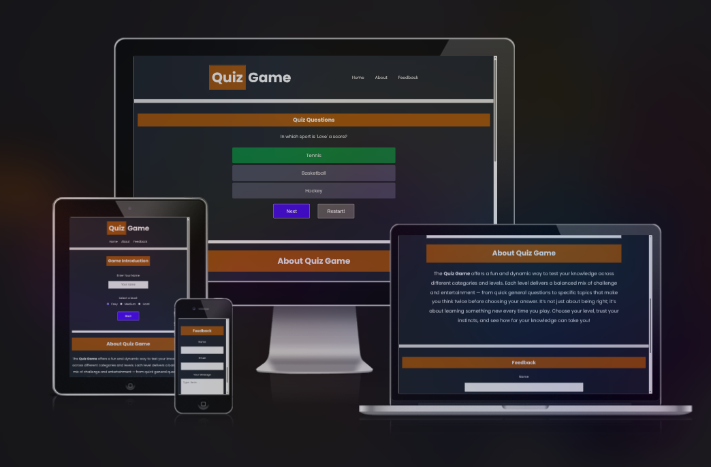
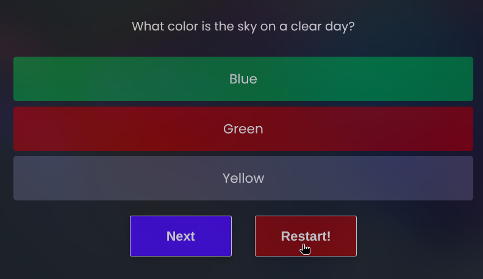
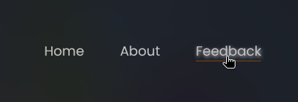
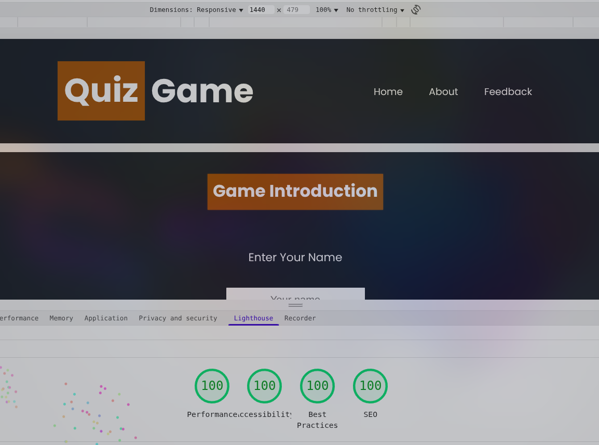

# 🧠 Simple Quiz Game

An interactive web-based quiz built with **HTML, CSS, and Vanilla JavaScript**, designed to provide a fun and educational experience for users.  
The game allows users to test their general knowledge through various levels, providing immediate feedback and a clean, responsive interface.

👉 [Quiz Game](https://tarik-box.github.io/Simple-Quiz-Game/)

---

## 📑 Table of Contents

1. [💡 Rationale and Purpose](#-rationale-and-purpose)  
2. [🕹️ Features](#️-features)  
3. [🧠 User Experience (UX) & Accessibility](#-user-experience-ux--accessibility)  
4. [🛠️ Technologies Used](#️-technologies-used)  
5. [📱 Responsiveness](#-responsiveness)  
6. [⚙️ Testing](#️-testing)  
7. [🚀 Deployment](#-deployment)  
8. [🧾 Version Control](#-version-control)  
9. [📂 File Structure](#-file-structure)  
10. [🧰 Code Structure and Logic](#-code-structure-and-logic)  
11. [🌱 Future Improvements](#-future-improvements)  
12. [📝 Credits](#-credits)  
13. [💭 Personal Reflection](#-personal-reflection)  
14. [⚖️ License](#-license)

---

## 💡 Rationale and Purpose

The main goal of this project is to create a small yet complete **front-end web application** that demonstrates:
- Proper **UX design** and **accessibility principles**
- Fully functional **interactivity** using core JavaScript
- Deployment and maintenance practices following modern standards

The project targets **beginners and casual users** who want to challenge themselves with a simple and intuitive quiz experience.  
It also serves as a learning milestone to showcase my understanding of responsive design, semantic HTML, and structured JavaScript logic.

---

## 🕹️ Features

- 🎯 Three difficulty levels: Easy, Medium, Hard  

- 👤 Custom username input with input validation 

 

- 🔄 Restart button for replaying the quiz anytime 

 

- ✅ Real-time feedback (correct/wrong answer highlights)

 

- 📊 Score summary at the end of the game  

- 🧭 Smooth navigation between sections 

 

- 📱 Fully responsive layout

- Image provided at [🧠 TOP ](#-simple-quiz-game)

- ♿ Accessibility-friendly structure using `aria` attributes and clear visual contrast

---

## 🧠 User Experience (UX) & Accessibility

- Logical flow: intro → questions → results → restart  
- Clear feedback: selected answers immediately marked as correct or wrong  
- Accessible colors (contrast between background and text)  
- Semantic structure: `<header>`, `<main>`, `<section>`, `<footer>` used consistently  
- ARIA attributes used for:
  - `aria-live="polite"` → to announce question changes  
  - `aria-label` for buttons and lists  
  - `aria-labelledby` for section headings  
- User is in control — no automatic transitions, only user-triggered actions

---

## 🛠️ Technologies Used

- **HTML5** for semantic structure  
- **CSS3** for layout, animation, and responsiveness  
- **JavaScript (ES6)** for game logic and interactivity  
- **Font Awesome** for social icons  
- **Google Fonts (Poppins)** for typography  
- **GitHub Pages** for hosting  

---

## 📱 Responsiveness

- Uses multiple **CSS media queries** to adjust spacing, font sizes, and layout for tablets and desktops.  
- All elements (buttons, text, containers) scale properly across devices.

---

---

## ⚙️ Testing

### ✅ Validation
- **HTML** validated using [W3C Validator](https://validator.w3.org/) — No errors or warnings to show. 
- 👉 [HTML](https://validator.w3.org/nu/?doc=https%3A%2F%2Ftarik-box.github.io%2FSimple-Quiz-Game%2F) 

- **CSS** validated using [Jigsaw Validator](https://jigsaw.w3.org/css-validator/) — No Error Found.. 
- 👉 [CSS](https://jigsaw.w3.org/css-validator/validator?uri=https%3A%2F%2Ftarik-box.github.io%2FSimple-Quiz-Game%2F&profile=css3svg&usermedium=all&warning=1&vextwarning=&lang=en)

- **JavaScript** checked using [JSHint](https://jshint.com/) — no critical warnings.
---
## Lighthouse Testing (Google Chrome DevTools)

The project was tested using **Lighthouse** in Google Chrome DevTools to measure performance, accessibility, best practices, and SEO.

### Desktop Results (PC)

- **Performance:** 💯 100
- **Accessibility:** 💯 100
- **Best Practices:** 💯 100
- **SEO:** 💯 100

---

### Mobile Results

- **Performance:** 99
- **Accessibility:** 💯 100
- **Best Practices:** 💯 100
- **SEO:** 💯 100

---

### 🧪 Manual Testing
- Tested across **Chrome, Firefox, and Edge**.  
- Checked:
  - Empty username field (error message displayed correctly).  
  - Level selection is working properly.  
  - Correct answer highlighted in green, wrong in red.  
  - Quiz restarts smoothly without console errors.  
  - Layout maintains integrity across screen sizes.  

---

## 🚀 Deployment

- Deployed using **GitHub Pages**  
- Live version: 👉 [Simple Quiz Game on GitHub Pages](https://tarik-box.github.io/Simple-Quiz-Game/)  
- Deployment process:
  1. Code pushed to the main branch  
  2. GitHub Pages enabled from repository settings  
  3. Verified that the hosted version matches the development version

---

## 🧾 Version Control

The project uses **Git & GitHub** for version control.  
Each commit:
- Represents a clear, single-purpose update (feature, fix, or improvement)  
- Has a **descriptive message** (e.g., “Add validation for username input” or “Improve mobile layout”)  

---

## 📂 File Structure

Simple-Quiz-Game/
│
├── index.html
├── css/
│ └── style.css
├── js/
│ └── script.js
├── images/
│ └── *
└── README.md

---

## 🧰 Code Structure and Logic

Most of the game logic is wrapped inside a single function `runGame()`  
→ This structure was chosen intentionally to **avoid global variables** and keep the logic encapsulated.  

Helper functions (like `showQuestion`, `checkAnswer`, `updateScore`) are defined inside `runGame()`, ensuring clean scope control and easier maintenance.
Its more suitable for a small, self-contained interactive app 
like this one.

---

## 🌱 Future Improvements

- Add a **timer** for each question  
- Include **sound effects** for correct/wrong answers  
- Create a **leaderboard** with local storage  
- Add **categories** (e.g., Science, Sports, History)
- Let **The User** set Questions amount
- Introduce **animations or transitions** between questions  

---

## 📝 Credits

- Fonts by [Google Fonts](https://fonts.google.com/)  
- Icons by [Font Awesome](https://fontawesome.com/)  
- All code written by **Tarik Box** — no external frameworks used.  
- README structure and formatting were organized with the help of **AI > ChatGPT** for clarity and professional presentation.

---

## 💭 Personal Reflection

This was my **first real project using JavaScript**, and it truly helped me understand how the language works in practice — from handling user input to managing interactivity and DOM updates.  
Through this project, I not only learned **JavaScript fundamentals**, but also improved my **HTML and CSS skills**, especially in creating accessible and responsive layouts.  

The process of debugging, testing, and refining the code taught me the importance of clean structure and logical flow.  
Overall, building this quiz game was both a challenge and a great learning journey that strengthened my confidence in front-end development.

---

## ⚖️ License

This project is open-source under the [MIT License](https://opensource.org/licenses/MIT).

---
